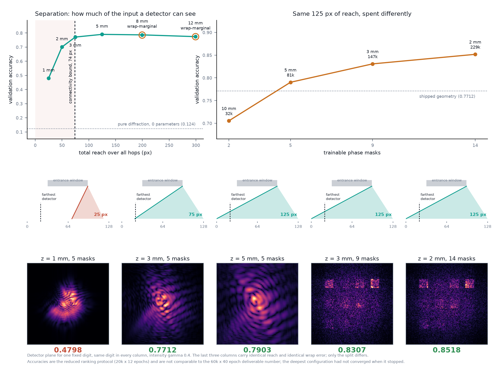

# Phase 2 — Diffractive network, ideal case

The Phase-1 propagator, recast as a differentiable layer and stacked with
trainable phase masks, trained to classify MNIST. This document is the Phase-2
deliverable: it states what was built, **what the masks do optically**, the
**optical power budget**, and — most importantly — the **expressivity limit
imposed by linearity**, which is the finding the rest of the project is set up
to characterise rather than engineer around.

Everything here is ideal (no fabrication error). The imperfect as-built model is
Phase 4, in MATLAB, fed through the handoff written by `apps/train_d2nn.py`.

---

## What Phase 2 delivers

| Phase-2 objective (CLAUDE.md) | Where |
|---|---|
| Phase-1 propagator recast as a differentiable layer | `layers.AngularSpectrumLayer` (wraps `propagate.angular_spectrum_transfer`) |
| Stack of phase masks trained to classify | `models.D2NN`, `train.train` |
| Input encoding chosen deliberately | `train.encode_input` — **both** amplitude and phase |
| Detector regions with integrated-intensity readout | `detect.DetectorRegion`, `detect.default_regions`, `detect.integrate_intensity`; differentiable readout in `D2NN.forward` |
| Optical power budget (photons/detector/inference) | `detect.photon_budget`, reported by `apps/train_d2nn.py` |
| Trained D²NN + physical interpretation + power budget + linearity limit | this doc + the exported handoff |

The machine-learning side is deliberately minimal (CLAUDE.md scope): the
electronic readout is *integrate intensity, softmax* and nothing more. The
softmax lives inside `CrossEntropyLoss`; there is no electronic hidden layer.

---

## Architecture and forward pass

A D²NN is `n_layers` trainable phase masks separated by free-space propagation:

```
input field ──prop──▶ mask₁ ──prop──▶ mask₂ ── … ──▶ mask_L ──prop──▶ detector plane
```

so there are `L` trainable masks and `L + 1` fixed propagations, every gap equal
to `separation`. At the detector plane the intensity `|E|²` is summed over each
detector region and normalised by the total output power, giving one
scale-invariant logit per class.

Physics stays pure NumPy (`propagate`, `elements`, `detect`); autograd lives only
in `layers`/`models` (CLAUDE.md convention). The differentiable propagator is a
*thin* wrapper: it precomputes the band-limited angular-spectrum transfer
function with the **same** NumPy routine the reference propagator uses
(`propagate.angular_spectrum_transfer`), stores it as a constant complex buffer,
and applies it with `torch.fft`. `tests/test_layers.py` checks the torch layer
reproduces `propagate.angular_spectrum` to `1e-10` in float64.

**Operating point (design choices, not error magnitudes).** Grid `N = 128`,
pixel pitch `dx = 8 µm` (typical SLM), wavelength `λ = 532 nm`, inter-plane
distance `3 mm`, `L = 5` masks. The propagation is well sampled: the critical
distance `z_crit = N·dx²/λ ≈ 15.4 mm` comfortably exceeds `3 mm`
(see `check_sampling`). These are operating-point constants like wavelength — not
sourced error values — so they need no citation; Phase-4 error magnitudes do.

---

## Input encoding — the deliberate choice

Phase 2 requires choosing how the image enters the field. We use **both**: each
28×28 image is bilinearly resized into the central 50 % of the grid (leaving a
margin for diffraction to spread into) and mapped to

```
E(x,y) = image(x,y) · exp( i · π · image(x,y) )
```

so the image modulates **both** amplitude and phase. The three schemes in
`encode_input` are:

- `amplitude` — `|E| = image`, phase 0 (an amplitude SLM).
- `phase` — `|E| = 1` inside an aperture, `arg(E) = π·image` (a phase SLM under
  plane-wave illumination).
- `both` — the product above.

Each encoded field is normalised to unit total intensity (`Σ|E|² = 1`); the
classifier is invariant to this scale, and it fixes a clean reference for the
photon budget.

**Physical caveat.** Independent amplitude *and* phase modulation is full complex
modulation, which a single SLM cannot do — it needs two cascaded modulators or a
complex-modulation trick. We use it because in-silico we can, and because — as
the linearity section explains — the encoding is the *only* place a nonlinear
transform of the raw pixels can be inserted before the optics. The as-built model
can revisit that hardware cost.

---

## What the trained masks do optically

Free-space propagation is a linear, shift-invariant operation — convolution with
the diffraction kernel. A phase mask is a pointwise multiplication by
`exp(iφ(x,y))`. Alternating them builds a cascade of *(multiply pointwise,
convolve)* steps: a programmable diffractive optical element, i.e. a learned
cascade of holograms.

Functionally, the masks learn to **route and focus** light: they shape the phase
front so that, after diffraction, an input of class *c* constructively
interferes onto detector region *c* and destructively elsewhere. Early masks
behave more like feature encoders that redistribute energy across the aperture;
later masks behave more like focusing/steering elements that concentrate the
class-dependent energy onto the correct detector patch. The trained phase
profiles and an example input→output intensity are rendered in
[`figures/phase2_masks.png`](figures/phase2_masks.png) (generated by
`apps/visualize_d2nn.py`).

Crucially, this "routing" picture is qualitative. The rigorous statement is in
the next section: the entire mask stack is *one linear operator*, and the masks
are simply a physically-realisable parameterisation of it.

---

## Optical power budget

For one inference at the illustrative operating point **1 mW × 1 ms at 532 nm**
(reported by `apps/train_d2nn.py`; `detect.photon_budget` does the accounting
from the exact SI constants `h`, `c`):

| Quantity | Value |
|---|---|
| Photon energy `hc/λ` | 3.73 × 10⁻¹⁹ J |
| Photons delivered per inference `N_in` | 2.68 × 10¹² |
| Fraction captured inside the 10 detectors | 60 % |
| Photons per detector region (mean) | 1.6 × 10¹¹ |
| Photons in the winning (predicted) detector (mean) | 5.3 × 10¹¹ |

**Reading it for Phase 4.** With ~5 × 10¹¹ photons in the winning detector, the
shot-noise relative fluctuation `1/√N ≈ 10⁻⁶` is negligible — at *this* operating
point detection is not shot-noise limited. That is itself a Phase-4 finding: shot
noise only bites once the power budget (or integration time) is pushed orders of
magnitude lower, and the tolerance curves will show where. The photon budget
established here is exactly the input `detect.shot_noise` will consume in Phase 4.

---

## The expressivity limit imposed by linearity

This is the central caveat of the whole diffractive approach, and Phase 2 exists
partly to state it precisely.

**The optical path is entirely linear in the field.** Propagation and phase (or
amplitude) masks are linear operators on the complex field `E`. Their
composition is a *single* linear operator `M`:

```
E_out = M · E_in ,   M = P_{L} D_L P_{L-1} D_{L-1} … D_1 P_0
```

where each `P` is a propagation and each `D` is a diagonal mask. No matter how
many mask+propagation layers are stacked, the field-to-field map collapses to one
linear map. Optical "depth" is **not** depth in the machine-learning sense: extra
diffractive layers add trainable parameters and let `M` better approximate a
desired linear operator *under the physical constraint* that it factorise into
phase-only masks separated by diffraction — but they add no nonlinear
compositional power.

**The only nonlinearity is intensity detection.** The logit for class *c* is the
intensity summed over its detector region:

```
s_c = Σ_{(x,y) ∈ region_c} |E_out(x,y)|²  =  E_in† A_c E_in ,   A_c = M† R_c M ⪰ 0
```

a positive-semidefinite **quadratic form** in the input field. So the classifier
computes, per class, one PSD quadratic form and takes the argmax. That is
strictly more than a linear classifier on the field, but it is exactly *one*
nonlinear layer — "linear optical transform → magnitude-square → linear sum" —
not a deep nonlinear network.

**Consequences, which the results bear out:**

1. Accuracy rises with layers/parameters only up to a **plateau** set by this
   linear-plus-one-square ceiling, not by optimisation effort. Coherent
   single-wavelength diffractive classifiers therefore sit well below nonlinear
   networks on MNIST.
2. The **input encoding is the only place a nonlinearity touches the raw
   pixels** before the optics. Phase encoding applies a nonlinear `exp(i·π·image)`
   map; that is why the encoding choice measurably changes achievable accuracy —
   it is doing nonlinear work the linear optics cannot.
3. Per CLAUDE.md scope, we **characterise and document** this limit; we do not
   add physical activation functions, and we do not grow the electronic head. If
   a larger electronic head would lift accuracy, that is a *finding*, not a bug to
   fix.

---

## Results

Trained with `apps/train_d2nn.py` (grid 128, 5 masks, `both` encoding, seed
`20260724`), Adam, cross-entropy over the detector logits:

- Train/test split: the full **60 000** MNIST training images, 2 000 held-out
  test images, 40 epochs.
- **Test accuracy: 0.799** (chance = 0.100).
- Trained parameters: 5 × 128² = 81 920 phase values (only the masks are
  trainable; propagation buffers and detector masks are constants).

Validation accuracy reaches **0.750 after a single epoch**, crosses 0.79 by epoch
7, and then climbs only ~0.01 over the remaining 33 epochs, ending in a
0.796–0.805 band:

| epoch | 1 | 2 | 4 | 8 | 16 | 24 | 32 | 40 |
|---|---|---|---|---|---|---|---|---|
| val | 0.750 | 0.767 | 0.776 | 0.793 | 0.793 | 0.802 | 0.799 | 0.799 |

The decisive number is not the accuracy but the **train/validation gap: 0.798 vs
0.799**. After 40 epochs on 60 000 samples, a model with 81 920 free parameters
still cannot pull ahead on its own training set. It is not data-starved and it is
not under-optimised — loss was still falling monotonically (1.6027 → 1.2725) while
validation had stopped moving. **This geometry is saturated.**

> **Correction (2026-08-06).** An earlier revision of this section read the
> plateau as "the linear-transform + single `|·|²` structure hitting its
> representational limit, measured rather than asserted." **That inference was
> wrong.** The plateau is real, but it belongs to *this geometry* — 5 masks at
> 3 mm — not to the architecture. The optics sweep below reaches **0.8518** with
> more masks, using a third of the data and less than a third of the epochs. The
> theory in the section above is unaffected: the stack really does collapse to one
> linear operator, and that section already says extra layers "let `M` better
> approximate a desired linear operator *under the physical constraint*". What was
> unwarranted was concluding that five masks had already exhausted that
> approximation. They had not, by at least eight points.

**This supersedes an earlier, weaker run** (12 000 images, 15 epochs, 0.7695) that
had not converged. Feeding it the full training set and 40 epochs was worth
**+3.0 points** and cost nothing in parameters, geometry or inference time. The
Phase-4 error budget was re-run against these masks and found the fabrication
tolerances **unchanged** (see `tolerance_d2nn.md`).

The exported handoff is `exports/d2nn_phase2.h5` (schema `0.1.0`, validated on
write).

---

## What the optics can still buy

Since the shipped geometry is saturated, the remaining levers are optical. There
are exactly two — inter-plane separation `z` and mask count `L` — and
`apps/sweep_optics.py` measures both. Everything electronic is held fixed
(same encoding, learning rate, batch size, seed); only geometry moves.



**Protocol.** Ranking runs use 20 000 training images for 12 epochs — deliberately
shorter than the deliverable run, because the question is *which geometry*, not
*what final accuracy*. **These numbers are not comparable to the 0.799 above**; the
comparison point is the shipped geometry re-run under the same short protocol,
which scores **0.7712**. Model selection never touches the frozen 2 000-image test
set: `train.split_dataset` carves a disjoint 4 000-image validation set out of the
training split, because that test set is exported in the handoff and every
downstream accuracy is quoted from it.

### The grid has an aperture, not just a sampling rate

`check_sampling` asks whether the transfer function is sampled finely enough
(`|z| ≤ z_crit = 15.40 mm`). It says nothing about whether the *window* is wide
enough to hold the spread — and `propagate.angular_spectrum` uses a plain `fft2`,
which is periodic, so energy leaving one edge reappears on the other.
`propagate.wraparound_error` measures that directly, against a zero-padded
reference:

| z | total reach | 1 hop | over 6 hops | detector logits |
|---|---|---|---|---|
| 1 mm | 24.9 px | 4.1e-04 | 3.1e-03 | 6.3e-05 |
| **3 mm** | 74.8 px | 1.3e-03 | **5.8e-02** | 6.2e-04 |
| 5 mm | 124.7 px | 2.2e-03 | 1.5e-01 | 9.0e-03 |
| 8 mm | 199.5 px | 4.6e-03 | 3.0e-01 | 4.2e-02 |
| 12 mm | 299.3 px | 1.7e-02 | 4.8e-01 | 1.2e-01 |

Three things follow. Wrap **compounds**: a negligible 0.13 % per hop is 5.8 % by
the detector plane. The **logits survive far better than the field**, because the
patches sit in the central 75 % while wrapped energy arrives at the edges — which
is why the shipped result stands despite a few percent of field error. And wrap
turns out to depend on **total reach alone**, not on how it is split: 2 mm × 9 hops
and 3 mm × 6 hops both reach 74.8 px and both mis-state the logits by 6.18e-04, to
three significant figures. Separation and depth therefore draw on **one shared
reach budget** — about 150 px on a 128 grid at a 2 % logit-error cap, which
`sweep_optics.py --max-wrap` enforces before spending compute on a configuration.

### Separation: accuracy is bounded by what a detector can see

| z | total reach | val acc | |
|---|---|---|---|
| — | 12.5 px | 0.1242 | pure diffraction, 0 trainable parameters |
| 1 mm | 24.9 px | 0.4798 | under-connected |
| 2 mm | 49.9 px | 0.7010 | under-connected |
| 3 mm | 74.8 px | 0.7712 | shipped |
| **5 mm** | 124.7 px | **0.7903** | best |
| 8 mm | 199.5 px | 0.7867 | wrap-marginal |
| 12 mm | 299.3 px | 0.7742 | wrap-marginal |

Accuracy climbs steeply while reach is below the **74 px** worst-case requirement
(`docs/phase3_mesh.md`) and flattens once it clears it. Below the bound the failure
is not statistical but geometric: part of the input *cannot* influence part of the
readout, whatever the masks are trained to. Past 5 mm the curve turns over — partly
wrap, partly energy spreading beyond the detector patches, and this sweep does not
separate the two. The zero-mask floor at **0.1242** against chance 0.100 confirms
the readout geometry is not doing the classifying.

### Depth: the same reach, spent differently

Because reach is shared, "does depth help?" cannot be asked by adding masks at
fixed `z` — that just spends more budget. Holding total reach at 124.7 px and
varying the split asks it properly. Every row below has **identical reach and
identical wrap error** (0.898 %); only the split differs.

| split | masks | parameters | val acc |
|---|---|---|---|
| 10 mm × 3 hops | 2 | 32 768 | 0.7055 |
| 5 mm × 6 hops | 5 | 81 920 | 0.7903 |
| 3 mm × 10 hops | 9 | 147 456 | 0.8307 |
| **2 mm × 15 hops** | **14** | **229 376** | **0.8518** |

**Depth is the better use of the budget, by a wide margin** — +8.1 points over the
shipped geometry under the same protocol, and reached with a third of the data and
under a third of the epochs of the 0.799 run. The deepest configuration had **not
converged** when it stopped (train 0.858 vs val 0.852, loss still falling), so
0.8518 is a floor.

The detector planes in the figure show the mechanism. At 2 and 5 masks the light
arrives as a diffuse interference pattern smeared across the plane; at 9 and 14 it
is gathered into discrete bright squares sitting on the detector patches. Identical
reach, identical physics — the extra masks buy the ability to *route* light into
the readout rather than merely scatter it there.

**What this does and does not establish.** In a D²NN mask count *is* parameter
count — 128² phases per mask — so `L` and parameter count cannot be varied
independently, and no experiment on this architecture separates "depth helps" from
"more parameters help". The defensible claim is the one measured: *at fixed
diffractive reach and fixed training budget, more masks help substantially.* Each
configuration is a single seed, so adjacent points are not separated by more than
run-to-run noise; the ordering across the range is far larger than that.

Nothing downstream has moved. `exports/d2nn_phase2.h5`, the browser bundle, the
Phase-4 budget and every quoted 0.799 still describe the 5-mask, 3 mm design —
promoting a new geometry is a separate decision, and because `z` is geometry it
would also re-derive the Phase-3 correspondence results (`z_min` = 2.967 mm,
"connected by 0.81 px").

Reproduce with:

```bash
python -m apps.sweep_optics --geometry        # wrap table; gates the rest
python -m apps.sweep_optics --arm z           # separation, ~35 min
python -m apps.sweep_optics --arm iso         # the reach-budget trade, ~25 min
python -m apps.sweep_report                   # figure + apps/web/optics_sweep.js
```

---

## Seeing the machine: the 3D stage

The trained network runs live in the browser (`apps/web/d2nn.js`, cross-checked to
torch), and the classifier page draws it two ways. The filmstrip is the precise
instrument — seven exact per-plane images. Above it, `apps/web/d2nn_stage.js`
draws the **optical stack itself**: the entrance plane, the five masks and the
detector plane as parallel panels along the optical axis, each carrying the field
computed on it, orbitable, with a sweep that walks one wavefront through.

Three things make that cheap and honest:

- An orthographic projection of a flat plane is **affine**, so one
  `setTransform` + `drawImage` renders a 128² plane as a correct parallelogram —
  no WebGL, no library, consistent with the rest of the browser side.
- The panels are parallel and never intersect, so **back-to-front painting is
  exact occlusion**. (Light is composited additively rather than occluded: the
  masks are transmissive, so a plate must not darken the field behind it.)
- The light **between** the masks is real. Sub-stepping a hop is exact because
  `H(z₁)·H(z₂) = H(z₁+z₂)` and the one z-dependent term — the Matsushima band
  limit — is inactive below `z_crit = N·dx²/λ = 15.40 mm`, against 3 mm hops.
  `NET.sliceForward` computes those intermediate planes; the equality and its
  breakdown above `z_crit` are both asserted in `tests/test_propagate.py`.

Two things it deliberately does not do. It **draws no rays** — scalar diffraction
is not ray optics, and straight lines from digit to detector would misrepresent
the physics this page exists to show. And it **cannot touch the prediction**:
`classify()` still runs the canonical `n_layers+1` propagations that the torch
cross-check pins, and `tests/test_d2nn_crosscheck.py` asserts logits are
bit-identical with slicing enabled.

The stack is 18 mm long across a 1.024 mm aperture — about 18:1 — so drawn to
scale it is an unreadable needle. The depth axis is compressed ~×5.9 and the
figure states that factor on its face.

---

## Reproduce

```bash
python -m apps.train_d2nn --quick          # ~15 s smoke config (grid 64)
python -m apps.train_d2nn                   # 12k subset, 15 epochs (fast, underfits)
python -m apps.train_d2nn --subset-train 60000 --epochs 40   # deliverable (~4.5 h CPU)
python -m apps.visualize_d2nn               # render trained masks + example
python -m apps.d2nn_demo                    # standalone live classifier + 3D stage
pytest -q tests/test_layers.py tests/test_models.py tests/test_detect.py tests/test_encode.py
pytest -q tests/test_d2nn_crosscheck.py tests/test_stage_projection.py
```

## What Phase 2 does not cover

- MZI mesh and Clements decomposition — Phase 3 (`mzi.py`, `layers.MZIMeshLayer`).
- Any hardware imperfection — Phase 4, MATLAB, via the handoff.
- Physical activation functions / nonlinear media — out of scope by design; the
  linearity limit above is the thing being characterised.

## References

- Lin et al., "All-optical machine learning using diffractive deep neural
  networks," *Science* 361:1004 (2018) — the D²NN architecture and the
  linear-optics + intensity-detection structure.
- Goodman, *Introduction to Fourier Optics*, 3rd ed. — propagation as a linear
  shift-invariant system.
- Matsushima & Shimobaba, IEEE TIP 18(11):2646 (2009) — the band-limited
  angular-spectrum transfer function shared by the propagator and the layer.
