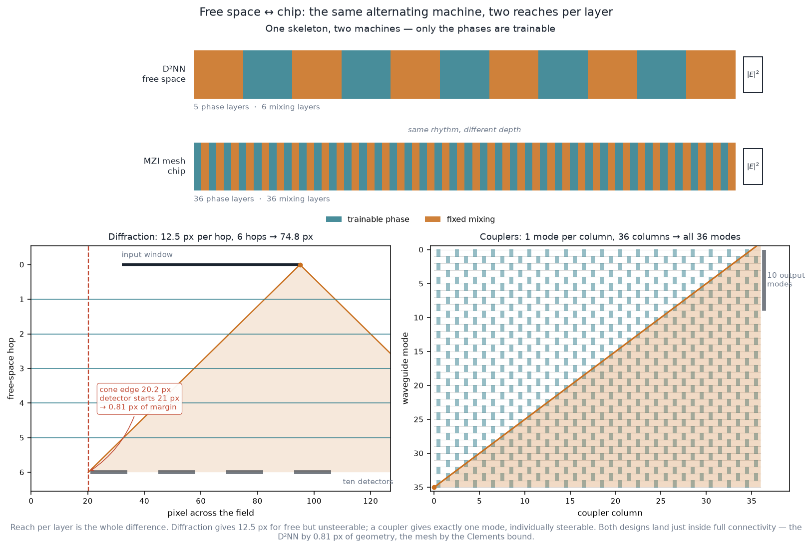

# Phase 3 — MZI mesh

The interferometer-mesh counterpart to the diffractive D²NN: a 2×2 MZI transfer
matrix built from coupler and phase-shifter primitives, universal decomposition
of any unitary into a mesh (Clements and Reck), an SVD layer for arbitrary real
matrices, a small mesh classifier trained on the shared MNIST task, and a direct
comparison to the D²NN. Classical only — the boson-sampling branch is deferred
(CLAUDE.md open-decision #3).

## What Phase 3 delivers

| Objective (CLAUDE.md) | Where |
|---|---|
| MZI transfer matrix from primitives, unitarity verified | `mzi.beamsplitter`, `mzi.phase_shifter`, `mzi.mzi_matrix`, `mzi.check_unitary` |
| Clements decomposition, verified by reconstruction | `mzi.clements_decompose` + `mzi.reconstruct` |
| Reck decomposition | `mzi.reck_decompose` |
| SVD layer (U·Σ·V†) for arbitrary real matrices | `mzi.svd_decompose` / `svd_reconstruct` |
| Small mesh network trained on a toy task | `models.MeshNetwork`, `layers.MZIMeshLayer`, `apps/train_mesh.py` |
| Direct comparison against the D²NN | this doc |
| Mesh toolkit: decomposition, verification, topology viz | `apps/mesh_toolkit.py` → `docs/figures/phase3_mesh_topology.png` |

Physics is pure NumPy in `mzi.py`; the differentiable mesh is a thin torch wrapper
(`layers.MZIMeshLayer`) checked against the NumPy reference — the same discipline
as the D²NN.

## The MZI and the mesh

The 2×2 MZI is two 50:50 directional couplers enclosing an internal phase θ,
preceded by an external phase φ (`B · P(θ) · B · P(φ)`), which evaluates to the
Clements (2016) convention

```
T(θ,φ) = i e^{iθ/2} [[e^{iφ} sin(θ/2),  cos(θ/2)],
                     [e^{iφ} cos(θ/2), -sin(θ/2)]]
```

always unitary (verified across the (θ,φ) range). A universal `MZIMeshLayer` is a
rectangular brick of `n` layers of MZIs on alternating adjacent mode pairs —
`n(n−1)/2` MZIs — the Clements topology, plus an output phase screen.

## Decomposition and verification

Any `N×N` unitary is decomposed by nulling its elements with MZIs — from the
right (T† on columns) and left (T on rows) for the balanced **Clements**
rectangular mesh, right-only for the triangular **Reck** mesh. Both **reconstruct
Haar-random unitaries to ~1e-15** with exactly `N(N−1)/2` MZIs (the correctness
anchor):

```
n= 4: clements 3.3e-16  reck 3.4e-16   (6 MZIs)
n= 6: clements 3.5e-16  reck 4.3e-16   (15 MZIs)
n= 8: clements 6.1e-16  reck 6.3e-16   (28 MZIs)
n=16: clements 7.2e-16  reck 1.0e-15   (120 MZIs)
```

The **SVD layer** decomposes an arbitrary real matrix as `M = U Σ V†` (two Clements
meshes around a diagonal), reconstructing it to ~1e-15. Passivity note: a lossless
mesh cannot amplify, so a physical `Σ` needs singular values ≤ 1 — the trained
mesh below violates this, a documented finding.

## The mesh classifier

`MeshNetwork` encodes MNIST (downsampled to 6×6 = 36 modes, unit-norm amplitudes)
into 36 modes, applies `U · Σ · V†` (an arbitrary learned linear map), and reads
intensity on the first 10 output modes — *integrate intensity, softmax*, no
electronic head, exactly as the D²NN. Trained with Adam, seed recorded.

- **Test accuracy: 0.736** (chance 0.10); 2 628 trainable parameters.
- The learned **Σ is effectively low-rank** (see `phase3_mesh_topology.png`): only
  ~15–20 of 36 singular values are significant, so the task uses far fewer than 36
  effective dimensions. Several σ exceed 1 — a real device would need gain or a
  global rescale-plus-loss.

## Why they are the same machine

A chip of waveguides and a stack of etched glass look like unrelated devices, and
the comparison table below reads that way too. They are not unrelated. Strip both
to their skeletons and the same sequence appears:

```
[ diagonal phase ] → [ fixed mixing ] → [ diagonal phase ] → [ fixed mixing ] → … → |E|²
```

| | **D²NN (free space)** | **MZI mesh (chip)** |
|---|---|---|
| a "channel" is | one pixel of the field — 16 384 of them | one waveguide mode — 36 of them |
| the **trainable** part | a phase mask, `e^{iφ}` per pixel | a phase shifter, `e^{iφ}` per MZI arm |
| set in hardware by | etched surface relief, or an SLM pixel | a thermo-optic heater current |
| the **fixed** part | 3 mm of air — diffraction | a 50:50 directional coupler |
| readout | integrated intensity, 10 detector boxes | intensity on the first 10 output modes |

**In both machines you only ever train phases. The mixing is unprogrammable
hardware in both.** A phase mask *is* a column of phase shifters; a 3 mm air gap
*is* a column of couplers. That is the whole free-space → chip transformation;
everything else is packaging.

This is a shared abstraction, not shared hardware — 16 384 pixels and 36 modes are
nowhere near the same scale, and no rearrangement turns one into the other.

### Reach per layer is the only real difference

The machines part on one axis: **how far one mixing layer moves information
sideways.** That number sets depth, footprint, and failure mode.

| | reach / layer | layers | total reach | channels | fully connected? |
|---|---|---|---|---|---|
| D²NN | **12.5 px** (`z·λ/(2·dx²)`) | 6 hops | 74.8 px | 16 384 px | yes, by **0.8 px** |
| Mesh (36-mode) | **1 mode** | 36 columns | 36 modes | 36 modes | yes, **by construction** |

Diffraction hands you a wide reach for free, but you cannot *choose* it: the
12.5 px is fixed by `z`, `λ` and the pixel pitch, and it is the same operator for
every pixel. A coupler reaches exactly one neighbour, so you need `N` columns —
and in exchange each of those `N·(N−1)/2` couplings is steered individually, which
is what makes any unitary realisable (Clements). **Free space → chip trades one
wide, fixed, unsteerable mixing operator for `N` sparse ones you can steer.**

The per-hop figure is `photonn.propagate.diffraction_reach_px`: the steepest ray
the grid can carry is at Nyquist, `f = 1/(2·dx)`, so one hop displaces energy by
at most `z·λ/(2·dx²)` **per axis** (the FFT band is a square in `(fx, fy)`, so `x`
and `y` bound separately). Below `z_crit = n·dx²/λ = 15.40 mm` the Matsushima band
limit is inactive and the full Nyquist band propagates; the Phase-2 gap is 3 mm,
well inside that.

### Finding: the D²NN is connected by 0.8 px

Six hops give **74.81 px** of reach. The worst case the design has to cover — an
input pixel at one edge of the entrance window (px 32–95) influencing the detector
pixel farthest from it (patches span px 21–106 in `x`, 25–102 in `y`) — is
**74 px**. So every input pixel *can* reach every detector region, with
**0.81 px of margin, about 1%**.

Equivalently, as a tolerance on the one dimension a builder sets: mask separation
must stay above **2.967 mm**, against a design value of 3.000 mm — **33 µm of
headroom**. Below it, part of the input becomes physically invisible to part of the
readout, whatever the masks are trained to.

Nothing in the training procedure knew about this bound; the operating point
happens to clear it. The mesh has no equivalent fragility — 36 columns for 36
modes is the Clements bound exactly, so full connectivity is guaranteed by the
topology. **One machine's connectivity is an accident that holds by 1%; the
other's is a theorem.**

Note this is a bound on what *can* couple, not a claim about how much power
actually does: the corner of the cone is the Nyquist ray, which carries little
energy in practice. It says where the design sits relative to a hard limit.

Derived, never typed: `apps/export_analogy_web.py` reads the reach from
`propagate.diffraction_reach_px`, the detector layout from `detect.default_regions`
and the topology from `layers.MZIMeshLayer._schedule`, and writes
`apps/web/analogy_geom.js`. `tests/test_correspondence.py` re-derives all of it.
The interactive version of this figure is `apps/web/analogy.js` (the site's
`chip.html`); the static one is below.



*The shared skeleton at both machines' true depths (top), and the reach that
explains the depth difference (bottom): a diffraction cone widening 12.5 px per
hop against a coupler cone widening one mode per column, each drawn against the
real detector layout and the real Clements schedule.*

## Direct comparison to the D²NN

| | **MZI mesh (36-mode SVD)** | **D²NN (Phase 2)** |
|---|---|---|
| Trainable parameters | **2 628** | 81 920 |
| MNIST accuracy | **0.736** | 0.799 |
| Depth | 72 MZI layers (serial) | 5 mask planes + 6 propagations |
| Footprint | 1 260 MZIs, scales as N²/2 | 5 × 128² phase pixels |
| Input it can ingest | 36 modes (must downsample to 6×6) | 28×28 embedded in a 128² field |
| Transform | **arbitrary** linear map | linear map **constrained** to phase-masks + diffraction |

The instructive result: the mesh **nearly matches** the D²NN — 0.736 vs 0.799 —
with **~31× fewer parameters**, implementing an *arbitrary* linear map rather than
a constrained one. It falls slightly short not because its transform is weaker (it
is strictly more general), but because **input dimensionality is the bottleneck**.
The mesh's footprint scales as `N²/2` MZIs, so ingesting a high-dimensional input
is prohibitively large; it is forced to downsample MNIST to 6×6 and starves on
information. The D²NN's footprint scales with the *field grid*, not the input
dimension, so it ingests the full-resolution image cheaply. This footprint ↔
input-dimensionality trade-off — parameter efficiency vs input capacity — is the
central structural difference between the two photonic processors.

**Failure modes** also differ: the mesh's error is dominated by **accumulation
through 72 serial MZIs** and by coupler imbalance / per-MZI loss (making the
realized transfer sub-unitary) — the MZI-specific error sources deferred from the
Phase-4 D²NN budget. The D²NN's error (from `docs/tolerance_d2nn.md`) is dominated
by **sub-pixel phase-crosstalk fidelity**, with per-pixel errors acting in
parallel rather than compounding serially. Both share the same expressivity
ceiling: one linear optical transform followed by `|·|²` detection.

## Verification

- `pytest -q` — 87 passing, 0 skips. `tests/test_mzi.py` covers MZI unitarity,
  Clements/Reck reconstruction, the SVD real-matrix layer, `mesh_forward` ==
  matrix multiply, and the torch mesh == NumPy replication.
- `tests/test_correspondence.py` re-derives every number in the section above —
  reach from the propagator, detector layout from `detect.default_regions`,
  topology from `MZIMeshLayer._schedule` — and fails if `analogy_geom.js` drifts.
  It also checks that `analogy.js` only reads fields the bundle defines, since a
  missing key renders as `undefined` in a browser rather than raising.
- `python -m apps.mesh_toolkit` — reconstruction to ~1e-15 and the topology figure.
- `python -m apps.train_mesh` — trains, exports the mesh handoff (`mesh` path,
  `phase_theta`/`phase_phi`), and prints the comparison.

## Reproduce

```bash
python -m apps.train_mesh            # train + export + comparison (deliverable)
python -m apps.train_mesh --quick    # fast smoke config
python -m apps.mesh_toolkit          # verify decompositions + render topology
python -m apps.export_analogy_web    # regenerate apps/web/analogy_geom.js
python -m apps.analogy_figure        # docs/figures/phase3_correspondence.png
pytest -q tests/test_mzi.py tests/test_correspondence.py
```

## What Phase 3 does not cover / next

- **Boson sampling** (single-photon input through the same mesh) — deferred to a
  dedicated branch (open-decision #3).
- **Mesh error budget** — the exported mesh handoff sets up extending the MATLAB
  error framework to the mesh (reactivating the deferred `coupler_imbalance` and
  per-MZI `loss` sources). A full SVD-mesh export would extend the handoff schema
  (Σ and output phases beyond `phase_theta`/`phase_phi`).

## References

- Reck, Zeilinger, Bernstein & Bertani, *Phys. Rev. Lett.* 73:58 (1994) — triangular mesh.
- Clements, Humphreys, Metcalf, Kolthammer & Walmsley, *Optica* 3(12):1460 (2016) — rectangular mesh + nulling algorithm.
